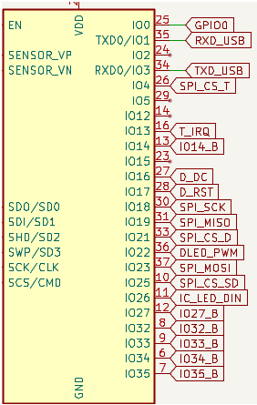
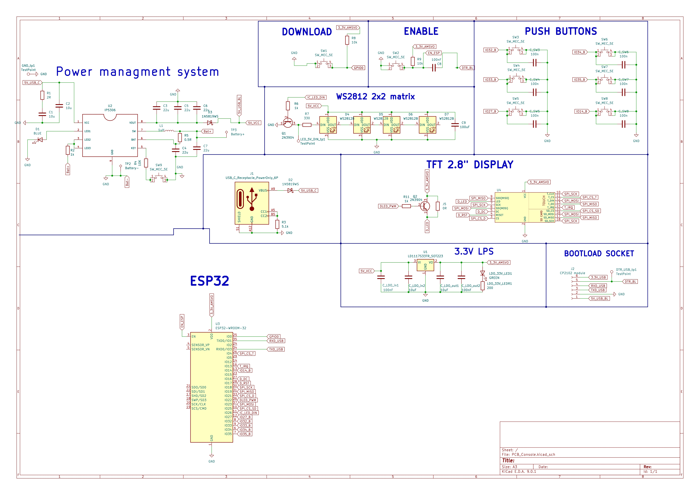
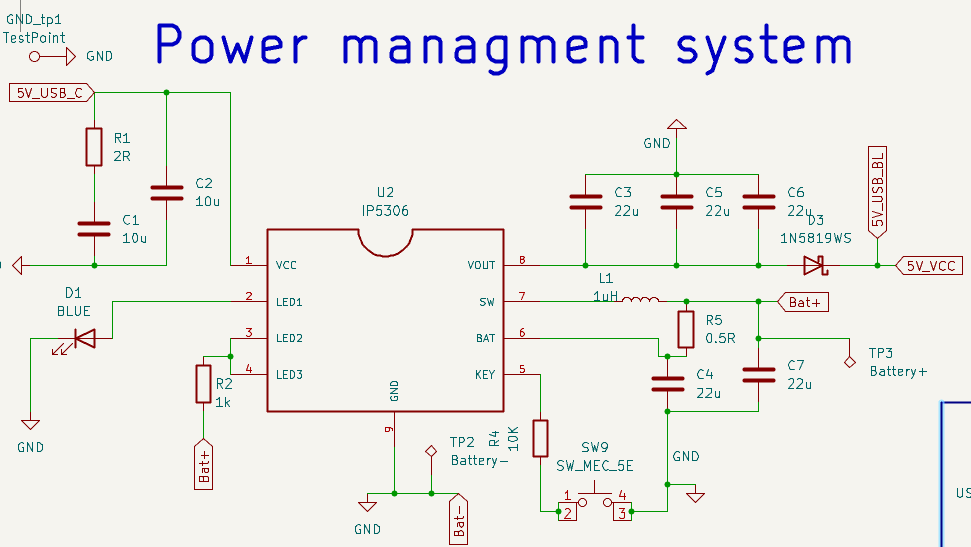

# 🛠️ PepeBoy

**Portable GameBoy style console. Based on ESP32 microprocessor, 2.8" TFT display, WiFi** 

---

## 📌 Table of Contents
- [🎯 Project Goal](#-project-goal)
- [🔧 Hardware Design](#-hardware-design)

- [💻 Usage](#-usage)
- [📸 Photos & Schematics](#-photos--schematics)
- [📜 License](#-license)
- [🤝 Contribution](#-contribution)

---

## 🎯 Project Goal

Portable and pocket size console, able to load games from external sd card. Possibility of on-line gameplay via Wi-Fi. Custom PCB board, self-made using CNC milling and UV solder mask paint. 3D printed box.

## 🔧 Hardware Design
tutaj jakiś tekst o tym że super fajny designe co jesti czemu to jest i jak bardzo cool jest pozdrawiam dam zdjecie schematu np:

### ESP32 pinout description
#### buttons 
| Button      | Switch id | GPIO  |
|:-----------:|:------:|:-----:|
| Right Button| SW_7   | IO35  |
| Left Button | SW_5   | IO27  |
| Up Button   | SW_4   | IO33  |
| Down Button | SW_6   | IO34  |
| A Button    | SW_8   | IO14  |
| B Button    | SW_3   | IO32  |

#### touch 

| Touch Signal  | Description          | GPIO  |
|:----------:|:--------------------:|:-----:|
| MISO       | Master In Slave Out   | IO19  |
| MOSI       | Master Out Slave In   | IO23  |
| CLK        | Clock                 | IO18  |
| CS_T       | Chip Select           | IO4   |
| T_IRQ      | Interrupt Handling    | IO13  |

#### display
| Display Signal | GPIO  | Description                          |
|:--------------:|:-----:|:-------------------------------------:|
| SPI_CS         | IO21  | Display Chip Select                  |
| SPI_MOSI       | IO23  | Master Out Slave In (data)           |
| SPI_MISO       | IO19  | Master In Slave Out (data)           |
| SPI_CLK        | IO18  | Clock signal                         |
| D_DC           | IO16  | Data/Command control                 |
| D_RST          | IO17  | Display reset signal                 |
| D_LED          | IO22  | Display backlight control            |
#### SD card

| SD Signal  | GPIO  | Description                 |
|:----------:|:-----:|:---------------------------:|
| SD_CS      | IO25  | Chip Select karty SD        |
| SD_CLK     | IO18  | Clock signal                |
| SD_MISO    | IO19  | Master In Slave Out (data)  |
| SD_MOSI    | IO23  | Master Out Slave In (data)  |

#### onePixel 2x2 led matrix
|2x2 LED signal|GPIO|Description|
|:--:|:--:|:--:|
|LED_DIN| IO26|Data in|

####  general SPI
| SPI Signal | GPIO  |
|:----------:|:-----:|
| MISO       | IO19  |
| MOSI       | IO23  |
| CLK        | IO18  |

  

<!-- 

  

 -->

### Power Management Unit (IP5306)  
The console can be powered remotely using, for example, a 18650 Li-ion battery. Plugging the console into external power through USB-C will power the device and charge the battery. The IP5306 is used according to the typical application from the [datasheet](https://www.datasheetcafe.com/wp-content/uploads/2020/07/IP5306.pdf). We used a one-LED configuration and skipped the KEY_LED (D5 on the datasheet).

  

## 💻 Usage

Description of how to use the project, e.g., how to start it, available modes, etc.

## 📸 Photos & Schematics

(Include circuit diagrams, wiring diagrams, photos of the finished device, etc.)

## 📜 License

Specify the license under which the project is distributed (e.g., MIT, GPL, CC BY-SA).

## 🤝 Contribution

Guidelines for contributions, reporting issues, ideas, and pull requests.

---

📧 **Contact**: [Your website / email / repository link]

